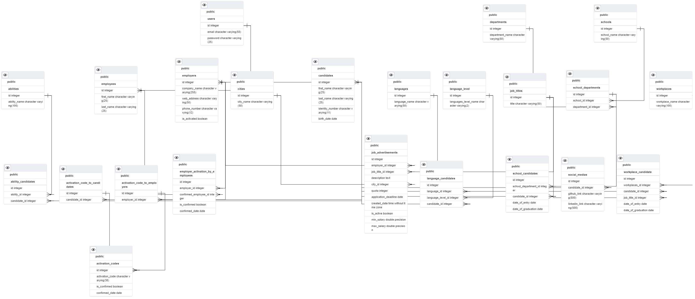

# HRMS (Human Resource Management System)
### PostgreSQL - Database
### <a href="Database.sql">Click</a> for script codes.
* * *

### Tablo yapısı:
- <b>users</b> (<i>tüm kullanıcı türlerini saklayacağımız ana tablomuz</i>)
	- <b>candidates</b> (<i>iş arayan kullanıcılar</i>)
	- <b>employees</b>  (<i>sistem çalışanları</i>) 
	- <b>employers</b> (<i>iş veren kullanıcılar</i>)
- <b>job_titles</b> (<i>iş pozisyonlarının isimlerini tutacağımız tablomuz.</i>)

### ER Diagram with PostgreSQL

